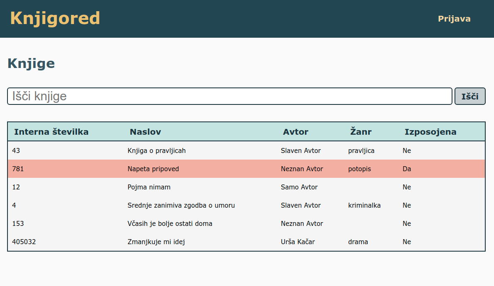
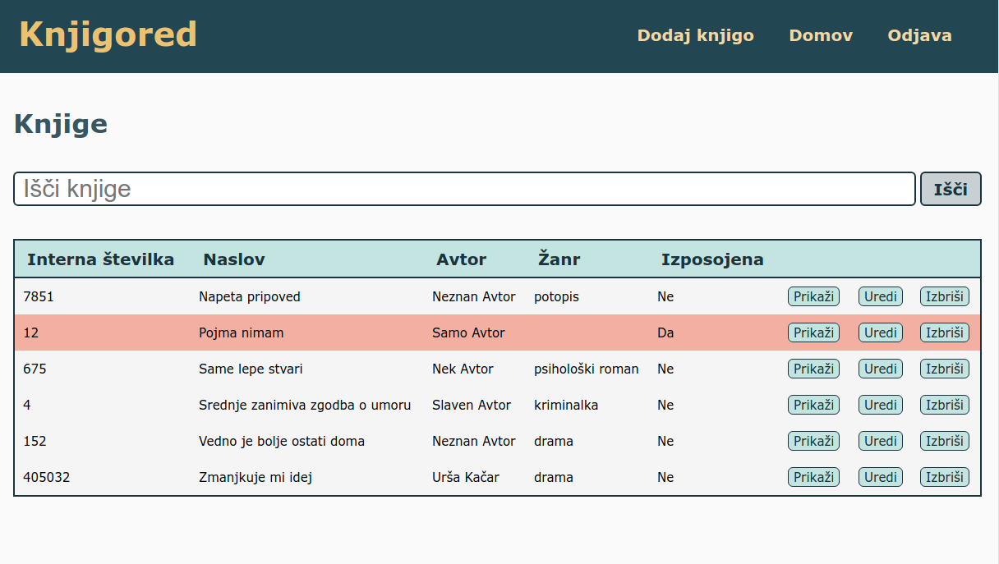
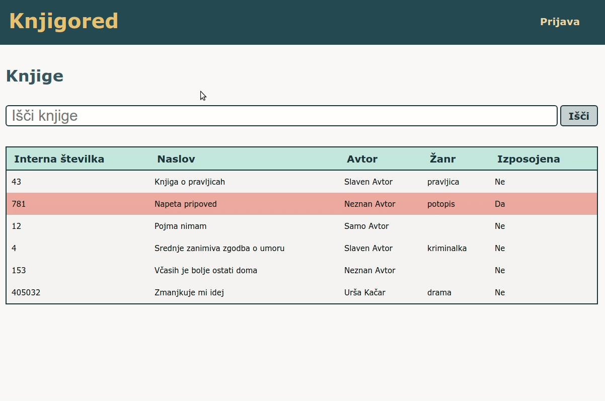
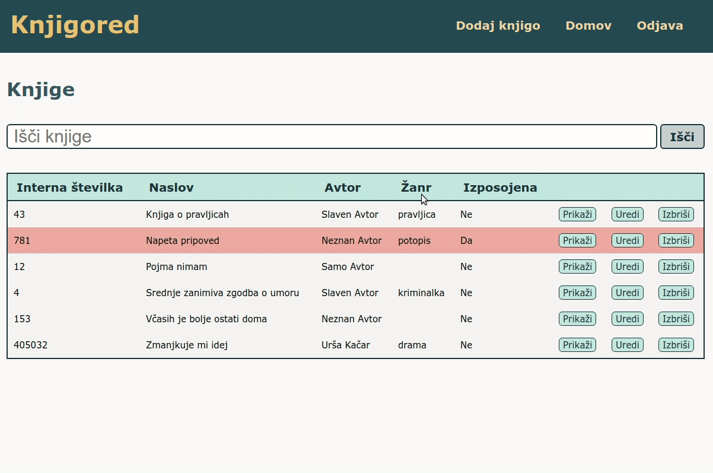
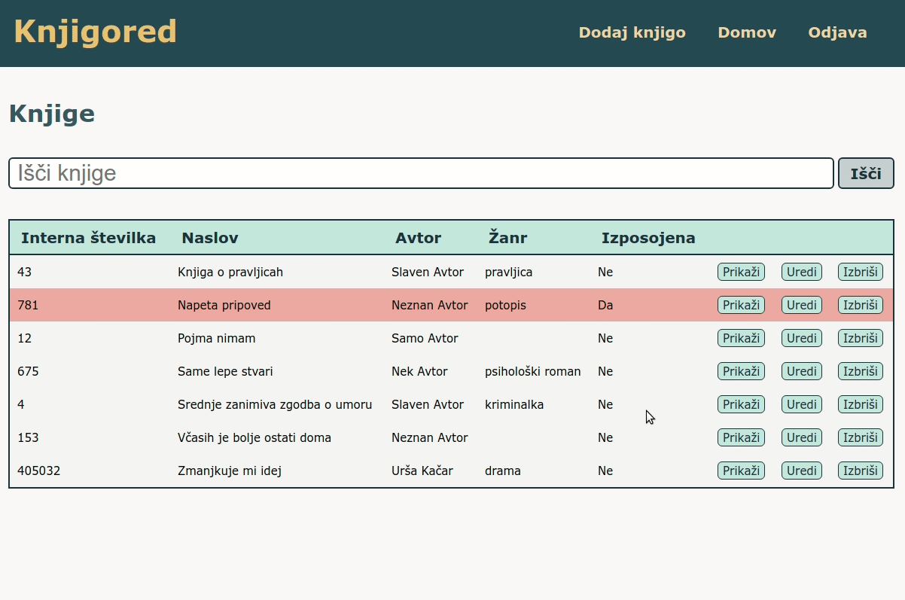
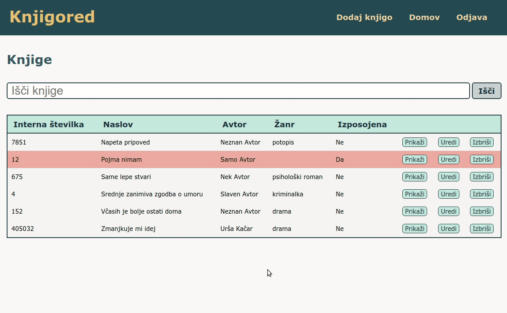
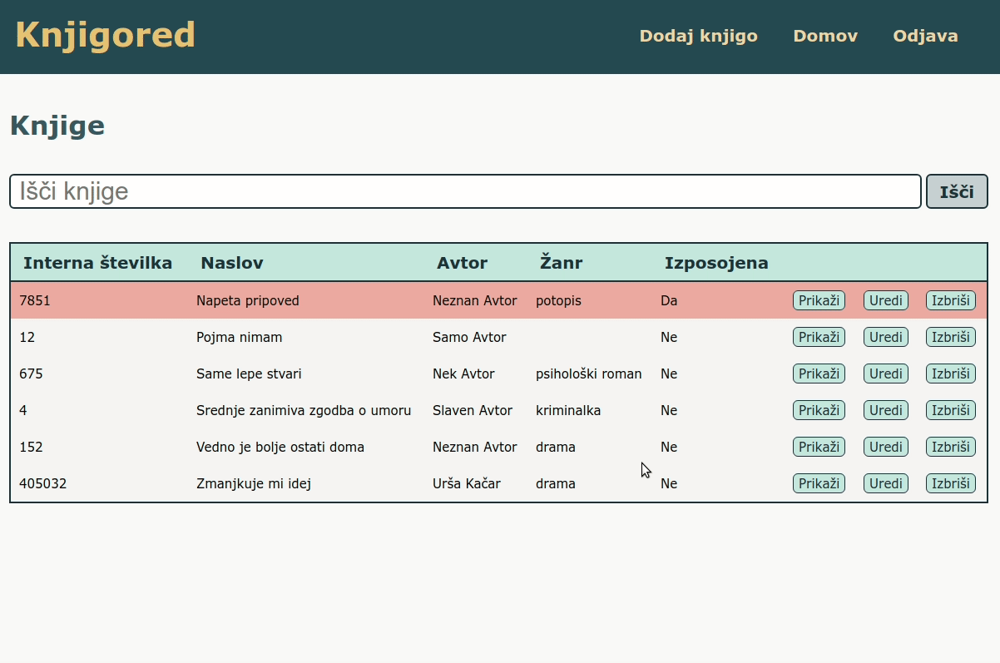
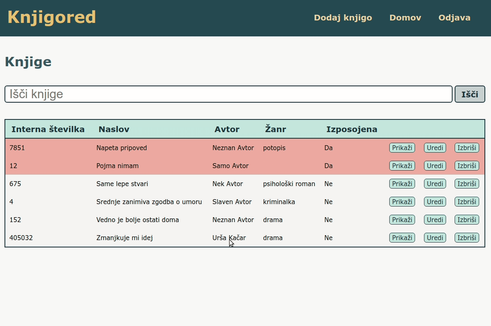

# KNJIGORED NAVODILA ZA UPORABO

<!---Instructions on how to use the app, written for my mum. Yes, there is duplication. Yes, there is usage of weird words that do not adhere to the industry standard. Remember, we are instructing a 70'something year old. I had to adapt.-->

## Prva stran
Ko slediš linku, ki sem ti ga poslala, se znajdeš na prvi strani Knjigoreda. Izgled strani je malenkost drugačen glede na to, ali si prijavljena ali ne.

Trenutno izposojene knjige so v seznamu označene z rdečim ozadjem.

### Neprijavljeni uporabnik

Neprijavljeni uporabnik v zgornji vrstici vidi napis **Prijava**. Prav tako vidi seznam vseh knjig- njihove interne številke, naslove, avtorje, žanre, ter ali je določena knjiga na voljo ali izposojena. 

### Prijavljeni uporabnik
Prijavljeni uporabnik v zgornji vrstici desno vidi napise **Dodaj knjigo**, **Domov** in **Odjava**. Poleg seznama knjig vidi zraven vsake knjige še dodatne tri gumbe: **Prikaži**, **Uredi**, **Izbriši**.

## Prijava
Za dodajanje, urejanje in izbris knjig je obvezna predhodna prijava v Knjigored. 

Če so v zgodnji vrstici desno napisi **Dodaj knjigo**, **Domov** in **Odjava**, pomeni, da si že prijavljena, in lahko začneš z dodajanjem in urejanjem knjig.

Če je v zgornjo vrstici desno napis **Prijava**, pomeni da trenutno nisi prijavljena. 

Takole se prijaviš:
* Klikni na **Prijava** desno zgoraj
* Vnesi uporabniško ime in geslo, ki sem ti jih poslala na email
* Klikni na siv gumb **Prijava**, ki se nahaja spodaj levo, pod poljem za geslo

Če se boš zmotila pri uporabniškem imenu ali geslu, ti bo javilo napako. Sicer boš uspešno prijavljena v Knjigored. 

## Iskanje

Iščeš lahko po interni številki, naslovu, avtorju ali žanru. 

* Klikni v iskalno polje, v katerem piše **Išči knjige**
* Vpiši iskalni niz
* Klikni na gumb **Išči**, ki se nahaja desno od iskalnega polja

Za ponovni prikaz vseh knjig, klikni na **Domov** v zgornji vrstici desno.

## Dodajanje knjige

Novo knjigo dodaš s klikom na **Dodaj knjigo**. 
Interna številka, naslov in avtor so obvezni. To pomeni, da knjige ne boš mogla shraniti, če ne boš vnesla vseh teh treh podatkov. Žanr je neobvezen, izbereš ga iz seznama. Če iskanega žanra ni na seznamu, me sporoči, da ga dodam.

* Prepričaj se, da si prijavljena v Knjigored
* Klikni na **Dodaj knjigo** v zgornji vrstici desno
* Vnesi podatke o knjigi:
  * Interna številka (obvezno) 
  * Naslov (obvezno) 
  * Avtor (obvezno)
  * Žanr (neobvezno): klikni na polje in izberi ustrezni žanr iz seznama. Če noben žanr ne ustreza, ponovno klikni na polje, da ga zapreš, ter me pokliči
* Klikni na siv gumb **Dodaj knjigo**, ki se nahaja spodaj levo

## Brisanje knjige

* Prepričaj se, da si prijavljena v Knjigored
* Klikni na gumb **Izbriši** poleg knjige, ki jo želiš izbrisati
* Odprlo se bo okno s tekstom **Ste prepričani, da želite izbrisati knjigo?**
* V tem novo odprlem oknu klikni na **OK**

## Popravljanje knjige

Vsaki obstoječi knjigi lahko spremeniš ime, žanr, avtorja, popraviš interno številko, ter označiš ali je knjiga izposojena ali na voljo.

* Prepričaj se, da si prijavljena v Knjigored
* Klikni na gumb **Uredi** poleg knjige, ki jo želiš popraviti
* Vnesi željene spremembe
* Klikni na gumb **Popravi knjigo**

### Izposoja knjige

Želiš označiti knjigo kot izposojeno? 

* Prepričaj se, da si prijavljena v Knjigored
* Klikni na gumb **Uredi** poleg knjige, ki jo želiš označiti kot izposojeno
* Pod žanrom se nahaja napis **Izposojena**, pod njim pa majhen siv 'kvadratek'
* Klikni na kvadratek- v njem se mora pojaviti kljukica
* Klikni na gumb **Popravi knjigo**

### Vračanje knjige

Je nekdo ravno vrnil izposojeno knjigo, in želiš v Knjigoredu zabeležiti, da je spet na voljo?

* Prepričaj se, da si prijavljena v Knjigored
* Klikni na gumb **Uredi** poleg knjige, ki jo želiš označiti kot vrnjeno
* Pod žanrom se nahaja napis **Izposojena**, pod njim pa majhen siv 'kvadratek' s kljukico
* Klikni na kvadratek - kljukica mora izginiti
* Klikni na gumb **Popravi knjigo**

To je to! Če se zatakne, me pokliči!

Objem,
Urša
